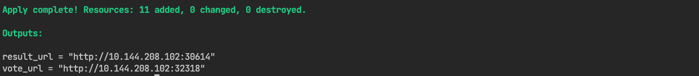

# Terraform Lab

As part of the Cloud Infrastructure course at IMT Atlantique Engineering School, this [lab](lab.md) is about deploying a distributed voting application on Docker, Kubernetes, and Proxmox using Terraform.

## Table of Contents

- [Prerequisites](#prerequisites)
- [Deploying the system with Terraform on your local Docker](#deploying-the-system-with-terraform-on-your-local-docker)
- [Deploying the system with Terraform on Kubernetes cluster](#deploying-the-system-with-terraform-on-kubernetes-cluster)
- [Deploying Redis on Proxmox VM and connecting it to Kubernetes cluster](#deploying-redis-on-proxmox-vm-and-connecting-it-to-kubernetes-cluster)

## Prerequisites

Make sure you have Terraform and Docker installed on your machine. You also need to have access to a Kubernetes cluster.

## Deploying the system with Terraform on your local Docker


To deploy the system using Terraform on Docker, navigate to the `terraform/docker` directory and run:

```sh
terraform init
terraform apply
```

The application will be deployed on your local Docker environment. You should see an output similar to the following after completion:


## Deploying the system with Terraform on Kubernetes cluster


To deploy the system using Terraform on Kubernetes, navigate to the `terraform/k8s` directory and run:

```sh
export KUBECONFIG=kubeconfig
terraform apply -var="kubeconfig_path=$KUBECONFIG"
terraform apply
```

Make sure to replace `kubeconfig` with the path to your actual kubeconfig file if it's located elsewhere. You should see an output similar to the following after completion:



## Deploying Redis on Proxmox VM and connecting it to Kubernetes cluster

To deploy Redis on a Proxmox VM and connect it to the Kubernetes cluster, first navigate to the `terraform/proxmox` directory and run:

```sh
export PM_API_TOKEN_ID='your_token_id'
export PM_API_TOKEN_SECRET='your_token_secret'
```

Make sure to replace `your_token_id` and `your_token_secret` with your actual Proxmox API token credentials. Also, before going further, check that the Proxmox configuration in `terraform/proxmox/pve_vm.tf` match your environment (`pm_api_url`, `ssh_key_path`, and `network_config`).

If you change the `vm_ip`, update `redis-endpoints.yaml` in `k8s-proxmox-manifests` folder accordingly. Finally run:

```sh
terraform init
terraform apply
```

This will create a VM on Proxmox. You then need to ssh into the VM and install Redis. You can use the provided `install-redis.sh` script in the `templates` folder. Finally, navigate to the `terraform/k8s-proxmox` directory and run:

```sh
export KUBECONFIG=kubeconfig
terraform apply -var="kubeconfig_path=$KUBECONFIG"
terraform apply
```

Make sure to replace `kubeconfig` with the path to your actual kubeconfig file if it's located elsewhere. This will deploy the application on the Kubernetes cluster, connecting it to the Redis instance running on the Proxmox VM. You should see an output similar to the following after completion:

